# Aether

**Experimental 64-bit Operating System Kernel in Rust**

[](https://github.com/ouzuka-m/aether/actions/workflows/rust.yml)


## What is Aether?

Aether is an experimental operating system kernel written in Rust, targeting x86_64 systems with UEFI boot via the [Limine](https://github.com/limine-bootloader/limine) boot protocol. The project focuses on safety and modern kernel design.

> [!NOTE]
> Aether is in early, active development. Expect frequent breaking changes.

## Hardware Requirements

- 64-bit Intel CPU with **TSC-Deadline** timer support
- **UEFI** firmware (legacy BIOS is **not** supported)
- **KVM** for virtualized testing (QEMU TCG is insufficient — TSC-Deadline is not fully emulated)

## Prerequisites

| Tool                     | Purpose                                |
| ------------------------ | -------------------------------------- |
| `rustc` + `cargo`        | Rust compiler and build system (nightly, pinned via `rust-toolchain.toml`) |
| `xorriso`                | Creating bootable ISO images           |
| `tar`                    | Packing the initial root filesystem    |
| `qemu-system-x86_64`    | Running the kernel in a virtual machine |
| OVMF                     | UEFI firmware for QEMU                 |

### Host Platform

> [!IMPORTANT]
> **Linux** is the only supported build and development platform.
> Windows and macOS have not been tested and are not supported.

### Installing Prerequisites (Arch Linux)

```bash
sudo pacman -S qemu-full xorriso edk2-ovmf
```

### Installing Prerequisites (Debian / Ubuntu)

```bash
sudo apt install qemu-system-x86 xorriso ovmf
```

Rust nightly is managed automatically via [`rust-toolchain.toml`](rust-toolchain.toml) — simply install [rustup](https://rustup.rs/) and the correct toolchain will be used.

## Building

Build scripts are located in the [`build/`](build/) directory.

### Debug Build

```bash
./build/debug.sh
```

Compiles the kernel in debug mode and creates `aether.iso`.

### Release Build

```bash
./build/release.sh
```

Compiles the kernel with optimizations and creates `aether.iso`.

Both scripts will:
1. Pack `rootfs/` into `iso/boot/initramfs.tar`
2. Compile the kernel ELF binary
3. Generate a bootable ISO with Limine

## Running with QEMU

After building, launch the ISO with QEMU + OVMF:

```bash
qemu-system-x86_64 \
  -bios /usr/share/edk2/x64/OVMF.fd \
  -cdrom aether.iso \
  -cpu host \
  -enable-kvm
```

To capture serial output in the terminal:

```bash
qemu-system-x86_64 \
  -bios /usr/share/edk2/x64/OVMF.fd \
  -cdrom aether.iso \
  -cpu host \
  -enable-kvm \
  -serial stdio
```

> [!TIP]
> The OVMF firmware path varies by distro. Common paths:
> - Arch Linux — `/usr/share/edk2/x64/OVMF.fd`
> - Ubuntu/Debian — `/usr/share/OVMF/OVMF_CODE.fd`

## Kernel Boot Sequence

Aether initializes its core subsystems in sequential phases starting from the Limine bootloader protocol up to the main interrupt-driven idle loop:

```mermaid
flowchart TD
    subgraph Bootloader["Phase 0: Bootloader Hand-off (Limine)"]
        L1["Firmware (BIOS/UEFI)"] --> L2["Limine Bootloader"]
        L2 --> L3["Parse Kernel ELF & Process Limine Requests<br/>(HHDM, Memmap, RSDP, Framebuffer, Modules, Cmdline)"]
        L3 --> L4["Setup Long Mode (x86_64) & Initial Page Tables"]
        L4 --> Entry["Jump to _start() in src/main.rs"]
    end

    subgraph EarlyInit["Phase 1: Early Kernel & CPU Architecture"]
        Entry --> CLI["Disable Interrupts (cli)"]
        CLI --> UART["Init Serial Logging (COM1 0x3F8) via LazyLock"]
        UART --> GDT["gdt::init()<br/>Load GDT & TSS (IST for DF, NMI, MCE)<br/>Reload CS, SS, TR"]
        GDT --> IDT["idt::init()<br/>Load IDT (Vectors 0-30 Exceptions, Vector 32 Timer, 33 Keyboard, 255 SVR)"]
    end

    subgraph MemoryInit["Phase 2: Memory Management"]
        IDT --> PTM["mapper::init()<br/>Read CR3 & create OffsetPageTable via HHDM"]
        PTM --> PFA["frame_allocator::init()<br/>Build Bitmap Allocator from Limine memory map"]
        PFA --> HEAP["heap_allocator::init()<br/>Allocate & map 1 MiB pages at 0xFFFF_9000_0000_0000<br/>Initialize Buddy Allocator (LockedHeap)"]
    end

    subgraph DriverInit["Phase 3: Drivers & Hardware Interrupt Routing"]
        HEAP --> ACPI["acpi::init()<br/>Locate RSDP via HHDM & parse ACPI tables"]
        ACPI --> PIC["pic::disable()<br/>Mask Intel 8259 PIC (Ports 0x21, 0xA1 = 0xFF)"]
        PIC --> HPET["hpet::init()<br/>Map HPET MMIO & enable main counter"]
        HPET --> LAPIC["lapic::init()<br/>Enable Local APIC & set SVR (Vector 0xFF)"]
        LAPIC --> TSC["tsc_deadline::init()<br/>Calibrate TSC against HPET (10 ms)<br/>Configure LVT (Vector 32) & arm first tick"]
        TSC --> IOAPIC["ioapic::init()<br/>Parse Interrupt Source Overrides<br/>Map PS/2 Keyboard (ISA IRQ 1 -> GSI -> Vector 33)"]
    end

    subgraph FSAndDisplay["Phase 4: Filesystem & Display"]
        IOAPIC --> TARFS["tarfs::init()<br/>Parse initial USTAR tar module (initramfs)"]
        TARFS --> GREET["greet::welcome()<br/>Read CPUID brand string & total RAM<br/>Draw banner to Framebuffer"]
        GREET --> QEMU["qemu::exit::success()<br/>Write 0x00 to port 0xF4 (CI debug-exit hook)"]
        QEMU --> PROMPT["prompt!()<br/>Print prompt ($) to screen"]
    end

    subgraph MainLoop["Phase 5: Runtime State"]
        PROMPT --> LOOP["Idle Loop<br/>enable_and_hlt() (sti; hlt)<br/>Wait for Hardware IRQs (Timer, Keyboard)"]
    end
```



### Boot Phases

1. **Bootloader Hand-off (Limine)**: The firmware loads Limine, which fulfills the static requests in [`src/boot/requests.rs`](src/boot/requests.rs) (HHDM offset, memory map, RSDP, framebuffer, and boot modules), switches the CPU to 64-bit long mode, and jumps to `_start`.
2. **Early CPU Architecture**: Disables CPU interrupts (`cli`), initializes COM1 UART serial output for logging, configures the Global Descriptor Table (GDT) and Task State Segment (TSS) with dedicated Interrupt Stack Table (IST) stacks, and loads the Interrupt Descriptor Table (IDT).
3. **Memory Management**: Constructs the virtual memory page mapper via HHDM from `CR3`, builds a bitmap-based physical frame allocator from the memory map, maps 1 MiB of pages starting at `0xFFFF_9000_0000_0000`, and initializes the buddy heap allocator.
4. **Drivers & Interrupt Routing**: Parses ACPI tables from RSDP, disables legacy 8259 PICs, initializes the High Precision Event Timer (HPET), enables the Local APIC, calibrates and arms the TSC-Deadline timer, and routes PS/2 keyboard IRQs through the I/O APIC.
5. **Filesystem & Display**: Parses `initramfs.tar` (USTAR module) via TarFS, displays system hardware information and CPU brand on the framebuffer, triggers QEMU debug-exit (for automated CI testing), prints the prompt (`$ `), and enters an interrupt-driven `hlt` idle loop (`sti; hlt`).

## Directory Layout

```
aether/
├── build/          Build scripts (debug.sh, release.sh)
├── iso/            ISO structure with Limine bootloader binaries
├── rootfs/         Root filesystem files packed into initramfs
├── src/            Kernel source code
│   ├── arch/         Architecture-specific code (x86_64)
│   ├── boot/         Boot initialization
│   ├── display/      Framebuffer and text rendering
│   ├── drivers/      Device drivers
│   ├── fs/           Filesystem (tarfs)
│   ├── log/          Kernel logging
│   ├── memory/       Frame allocator, mapper, heap
│   ├── qemu/         QEMU integration utilities
│   ├── config.rs     Kernel configuration
│   └── main.rs       Kernel entry point
├── targets/        Custom target specification (x86_64-unknown-none.json)
├── linker.ld       Linker script for kernel section layout
├── Cargo.toml      Package manifest and dependencies
└── rust-toolchain.toml  Pinned nightly Rust toolchain
```

## Contributing

See [CONTRIBUTING.md](CONTRIBUTING.md) for guidelines on code quality, toolchain management, and contribution workflow.

## License

Aether is licensed under the [GNU General Public License v2.0 (GPL-2.0)](LICENSE).
